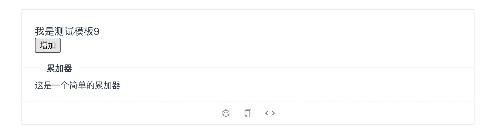
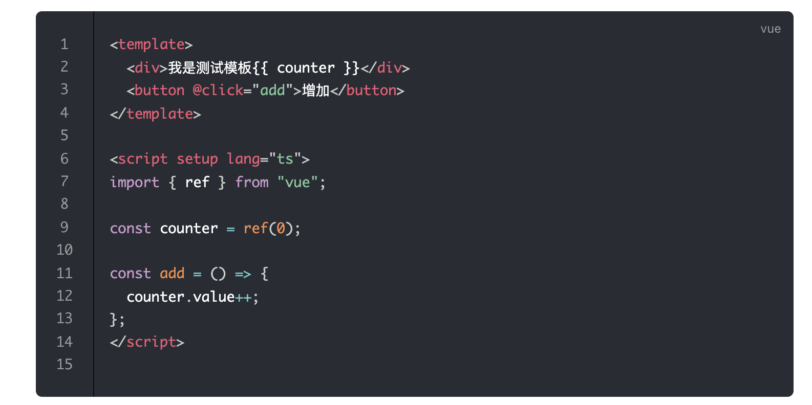
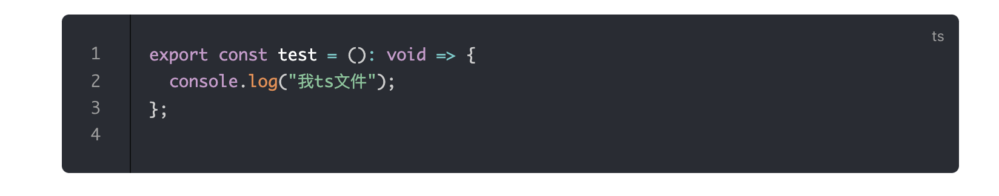

# code-block代码块插件

`vuepress-plugin-code-block`是一个基于[vuepress@next](https://v2.vuepress.vuejs.org/)版本的主题插件，他会帮助你再编写组件文档的时候增加`vue`示例。

目前的示例模板是按照[ant-design-vue](https://next.antdv.com)去实现的，感兴趣的小伙伴可以自定义实现。

目前还在开发阶段，希望大家在使用的过程中出现的bug或者问问题，欢迎提交issue和PR。

## 安装

在安装次插件之前，请确保您已经安装了`vuepress@next`版本

```shell

npm i -D @yanyu-fe/vuepress-plugin-code-block

yarn add -D @yanyu-fe/vuepress-plugin-code-block

pnpm add -D @yanyu-fe/vuepress-plugin-code-block

```

## 使用

在`.vuepress`文件夹下创建一个`config.ts`文件，配置如下

```ts
import { defineUserConfig } from "vuepress";
export default defineUserConfig({
  title: "文档",
  plugins: [codeBlockPlugin()],
});

```

注册完成后，我们就可以直接在markdown中使用啦！

### 编写组件例子

* 普通vue文件支持

```markdown

<demo src="./demo/test.vue" title="测试demo" desc="这是一个测试的`demo`"></demo>

```

* tsx(jsx)文件支持

目前已经支持了tsx文件

```markdown

<demo src="./demo/test.tsx" title="测试demo" desc="这是一个测试的`demo`"></demo>

```



### 显示代码块

引入之后只显示代码块，不需要转换为示例

```markdown

<demo src="./demo/test.tsx" raw></demo>

<demo src="./demo/test.vue" raw></demo>

```




### 其他语言使用`demo`组件的处理方法

目前对于其他的语言如`ts/js/html/css`等文件进行处理，目前只能转换为代码块显示

```markdown

<demo src="./demo/test.ts"></demo>

```




## `demo`属性支持

| 参数    | 类型      | 默认值  | 描述             |
| ------- | --------- | ------- | ---------------- |
| `raw`   | `boolean` | `false` | 是否显示源代码块 |
| `title` | `string`  | -       | 标题             |
| `desc`  | `string`  | -       | 描述             |
| `src`   | `string`  | -       | 示例绝对路径     |


目前规划的属性较少，有小伙伴可以参考自定义

## 演示

演示站点目前还在筹划中。。。
